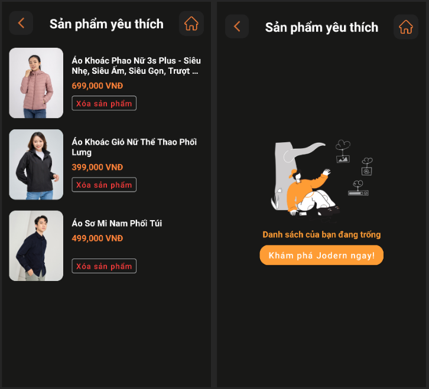
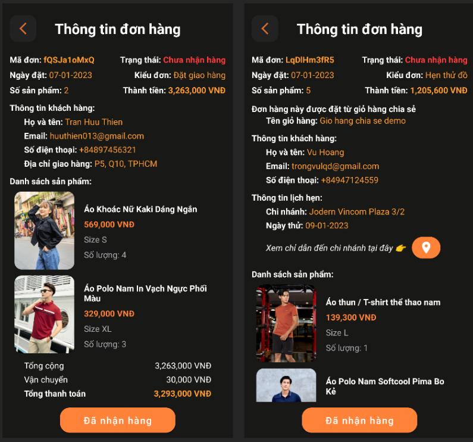

# **Jodern**
This is our's project for midterm exam of the android course at HCMUS. 

## **Navigation**

- [**Jodern**](#jodern)
  - [**Navigation**](#navigation)
  - [**Features**](#features)
    - [**Login**](#login)
    - [**Onboarding**](#onboarding)
    - [**Shopping Time**](#shopping-time)
      - [**Product details**](#product-details)
    - [**Lookup**](#lookup)
      - [**Image search**](#image-search)
      - [**Text search**](#text-search)
      - [**Voice search**](#voice-search)
    - [**Share Product**](#share-product)
    - [**Profile Page**](#profile-page)
    - [**Wishlist**](#wishlist)
    - [**Cart System**](#cart-system)
      - [**Personal Cart**](#personal-cart)
      - [**Shared Cart**](#shared-cart)
    - [**On Checkout**](#on-checkout)
      - [**Delivery Order**](#delivery-order)
      - [**Pick-up Order**](#pick-up-order)
    - [**Order Confirmation* Mail**](#order-confirmation)
    - [**Order Details**](#order-details)
    - [**Map**](#map)
  - [**Project**](#project)
    - [**Android**](#android)
    - [**Backend**](#backend)

## **Features**

### **Login**

    
    

### **Onboarding**

    
    

### **Shopping Time**

    
    <!-- 
    
     -->

#### **Product details**

    
    

### **Lookup**

#### **Text search**

    
    

#### **Voice search**

    
    

#### **Image search**

    
    
    

### **Share Product**

    

### **Profile Page**

    

### **Wishlist**

    

### **Cart System**

<!-- 

    

 -->

#### **Personal Cart**

    

#### **Shared Cart**

    
    
    <!-- 
    
     -->

### **On Checkout**

#### **Delivery Order**

    
    

#### **Pick-up Order**

    <!-- 
     -->
    

### **Order Confirmation Mail**

    
    

### **Order Details**

    

<!-- 

    

 -->

### **Map**

    
    

## **Technologies**

### **Frontend**
- Android Studio (Java)

### **Backend**
- Microsoft Azue Services
- SQL Server
- Django framework
- Deep learning models:
    - Swin Transformer V2 Tiny 
    - Vietnamese-SBERT
- Faiss library for efficient searching